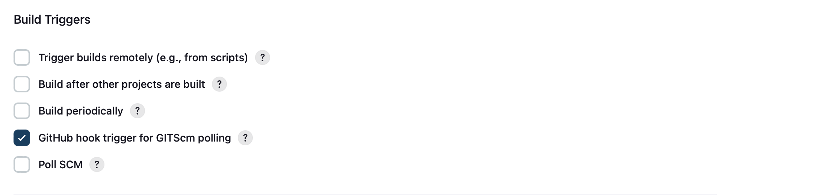

# Tooling_Website_Deploymeny_with_CI_Jenkins

# Task Overview

The objective of this task is to improve upon the architecture established in Project 8 by integrating a Jenkins server into the workflow. Jenkins will facilitate continuous integration and continuous deployment (CI/CD) for your project, ensuring that any changes made to the source code are automatically deployed to the NFS (Network File System) server.

## Objectives

1. **Set Up Jenkins Server:**
   - Install Jenkins on a dedicated server.
   - Configure Jenkins to work within your existing network infrastructure.

2. **Configure Job in Jenkins:**
   - Create a new job in Jenkins that will monitor a specified Git repository for any changes.
   - Use Webhooks or Polling to trigger the job whenever there’s a new commit or push to the repository.

3. **Define Deployment Steps:**
   - Set up the necessary scripts and commands in Jenkins to pull the latest code from the Git repository.
   - Ensure the pulled code is deployed to the NFS server.

4. **Test the Continuous Integration/Deployment:**
   - Make a change in the Git repository and commit/push it.
   - Verify that Jenkins detects the change and successfully deploys the updated code to the NFS server.

## Updated Architecture

Upon completion of this task, the architecture will look like this:


## Requirements

- A running instance of Jenkins.
- Access to a Git repository containing the source code.
- Proper permissions to deploy to the NFS server.
- Basic knowledge of Jenkins and Git workflows.

# Step 1 - Install Jenkins Server

## 1. Create Jenkins EC2 Instance

- Create an AWS EC2 server based on Ubuntu Server 20.04 LTS and name it "Jenkins" in a region "mumbai" with instance type "t2.small", at first created security group configuration was selected as default here and connected to virtual server using same ".pem" file as the same private key was used for this instance.
- Private key was generated and named it as : "tooling_private_key" and downloaded ".pem" file.
- Used the same private key previously downloaded to connect to EC2 instace via ssh as in previous projects.


## 2. Install Java Development Kit (JDK)

```
sudo apt update
sudo apt install default-jdk-headless
```


## 3. Install Jenkins

To install Jenkins, we need to add the Jenkins repository to our system, import the repository key, update the package list, and then install Jenkins.

```
wget -q -O - https://pkg.jenkins.io/debian-stable/jenkins.io.key | sudo apt-key add -
sudo sh -c 'echo deb https://pkg.jenkins.io/debian-stable binary/ > \
    /etc/apt/sources.list.d/jenkins.list'
sudo apt update
sudo apt-get install jenkins
```


## 4. Verify Jenkins Installation

After installation, Jenkins should start automatically. You can verify its status with:

```
sudo systemctl status jenkins
```


## 5. Configure Firewall

Jenkins uses TCP port 8080 by default. You need to open this port in your EC2 Security Group to allow incoming traffic.

- Create a new Inbound Rule in your EC2 Security Group:

Type: Custom TCP
Port Range: 8080
Source: Anywhere (0.0.0.0/0) or your specific IP for better security


## 6. Initial Jenkins Setup

- Access Jenkins from your browser: 
```
http://<your-ec2-public-ip>:8080
```

- You'll be prompted for the initial admin password. Retrieve it from your server:
```
sudo cat /var/lib/jenkins/secrets/initialAdminPassword
```

- Choose "Install suggested plugins" when prompted for plugin installation.


- Create an admin user when asked.

- You'll receive the Jenkins server address - make note of this.

## Conclusion:
Jenkins installation is now complete and ready for use.


# Step 2 - Configure Jenkins to Retrieve Source Code from GitHub using Webhooks

In this section, you'll learn how to set up a simple Jenkins job that automatically retrieves code from GitHub when triggered by a webhook.

## 1. Enable Webhooks in GitHub

1. Go to your GitHub repository
2. Click on "Settings"
3. Select "Webhooks" from the left sidebar
4. Click "Add webhook"
5. Set Payload URL to `http://<jenkins-server-ip>:8080/github-webhook/`
6. Choose "application/json" for Content type
7. Select "Just the push event" for events to trigger the webhook
8. Click "Add webhook" to save


## Step 2. Create a New Jenkins Job

1. Open Jenkins web console
2. Click "New Item"
3. Enter a name for your project
4. Select "Freestyle project"
5. Click "OK"


## Step 3. Configure Source Code Management

1. In the job configuration, scroll to "Source Code Management"
2. Select "Git"
3. Enter your GitHub repository URL
4. Provide credentials if the repository is private
5. Save the configuration

## Step 4. Configure GitHub Webhook Trigger

1. In the job configuration, go to "Build Triggers"
2. Check "GitHub hook trigger for GITScm polling"

## Step 5. Configure Post-build Actions

1. Scroll to "Post-build Actions"
2. Click "Add post-build action"
3. Select "Archive the artifacts"
4. In "Files to archive", enter `**` to archive all files


## Step 6. Save and Test

1. Save the job configuration
2. Make a change to your GitHub repository (e.g., edit README.md)
3. Commit and push the change

Jenkins should automatically start a new build. You can verify this in the Jenkins dashboard.


## Step 7: Verify Artifacts

After a successful build, you can find the archived artifacts on your Jenkins server:

```
ls /var/lib/jenkins/jobs/tooling_github/builds/<build_number>/archive/
```


Replace <build_number> with the actual build number.


Conclusion

We have now set up an automated Jenkins job that:

- Is triggered by GitHub webhooks when changes are pushed
- Retrieves the latest code from your GitHub repository
- Archives the files from the build as artifacts
- This setup demonstrates a basic Continuous Integration (CI) pipeline, automatically capturing and storing the latest version of your codebase whenever changes are made.

# Step 3 - Configuring Jenkins to Copy Files to NFS Server via SSH

## 1. Install "Publish Over SSH" Plugin

Jenkins is highly extensible with over 1400 plugins available. We'll use the "Publish Over SSH" plugin for this task.

- On the main dashboard, select "Manage Jenkins"
- Choose "Manage Plugins"
- Go to the "Available" tab
- Search for "Publish Over SSH"
- Install the plugin
- Publish Over SSH Plugin


## 2. Configure SSH Connection to NFS Server

- From the main dashboard, select "Manage Jenkins"

- Choose "Configure System"

- Scroll down to the "Publish over SSH" section

- Configure the following:

    - Private Key: (Content of your .pem file used to connect to the NFS server)
    - Name: (Arbitrary name for this configuration)
    - Hostname: (Private IP address of your NFS server)
    - Username: ec2-user (assuming NFS server is on EC2 with RHEL 8)
    - Remote Directory: /mnt/apps
    - Test the configuration to ensure it returns "Success"

Note: Ensure TCP port 22 on the NFS server is open for SSH connections.


## 3. Configure Jenkins Job to Copy Artifacts

- Open your Jenkins job/project configuration page
- Add a new "Post-build Action"
- Select "Send build artifacts over SSH"
- Configure as follows:
    - Source files: ** (to copy all files and directories)
    - Remote directory: (Leave blank if you want to use the default configured earlier)
    Tip: Use specific patterns if you want to copy only certain files.


## 4. Test the Configuration

- Make a change to the README.MD file in your GitHub Tooling repository
- The webhook should trigger a new Jenkins job
- Check the "Console Output" of the job for success message:
```
SSH: Transferred 25 file(s)
Finished: SUCCESS
```


## 5. Troubleshooting NFS Server Permissions

If you encounter errors, adjust the NFS server permissions:
```
sudo chown -R nobody:nobody /mnt
sudo chmod -R 777 /mnt
```

## 6. Verify File Transfer

SSH into your NFS server and check the README.MD file:
```
cat /mnt/apps/README.md
```

If you see the changes you made in GitHub, the job is working correctly.

We have successfully implemented a Continuous Integration solution using Jenkins CI.


